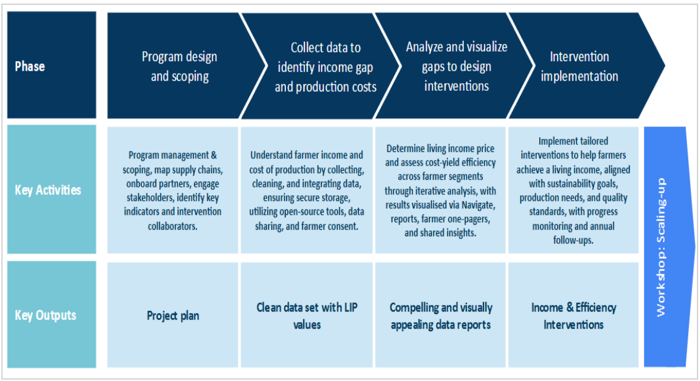

Around the world, sustainability teams are under growing pressure to demonstrate how their supply chains contribute to more equitable livelihoods—not only in *principle*, but in *practice*. Currently being discussed, new regulations such as the [EU Corporate Sustainability Due Diligence Directive (CSDDD)](https://commission.europa.eu/business-economy-euro/doing-business-eu/sustainability-due-diligence-responsible-business/corporate-sustainability-due-diligence_en) and the [EU Deforestation Regulation (EUDR)](https://environment.ec.europa.eu/topics/forests/deforestation/regulation-deforestation-free-products_en) are pushing companies to take more responsibility for what happens at the start of their chains. This means finding concrete ways to support smallholder incomes, improve data quality, and strengthen long-term supply relationships.

The Living Income Price (LIP) Toolkit helps you do just that. Developed by **Fairfood** and **Akvo**, the toolkit is the culmination of a five-year programme funded by the Dutch Ministry of Foreign Affairs. The programme focused on testing and developing models that promote **fairer value distribution** as a cornerstone of **resilient, inclusive, and consequently more sustainable supply chains**. As a response to that, the LIP Toolkit offers an end-to-end approach for identifying income gaps, designing solutions, and supporting evidence-based decision making across supply chains.

### **A data-first approach**

The LIP Toolkit is built around a two-step strategy to close income gaps and enhance supply chain resilience:

1. **Living Income Price (LIP).** At its core, the toolkit calculates a price floor that covers the real cost of producing a crop—whether **at farmgate, cooperative, and Free-on-Board (FOB) levels**—while still enabling a decent standard of living. By quantifying the gap between current prices and a living income benchmark, you can pinpoint how far the supply chain must move.

2. **Cost-Yield Efficiency (CYE).** Price alone rarely closes the gap, and that’s where the CYE assessment comes in. This analysis classifies farmers by both costs and yields, highlighting who is efficient, who is struggling, and why. This dual lens identifies where cost-saving, productivity, or diversification measures might help—and where pricing interventions are really unavoidable.

Used together, the LIP and CYE methodologies form a two-step strategy: first, to **diagnose** income gaps and how efficiently farmers are operating through rigorous, context-specific data collection and analysis; and second, to (co-)**design** realistic interventions that are grounded in evidence and are shaped with input from different supply chain actors, especially producers.

More than a set of tools, this is a practical approach to support informed decision-making and encourage data-driven investment in agri-food supply chains. Using a bottom-up approach, this toolkit outlines the steps to identify and cost solutions for more equitable value distribution. And because it pulls together several strategies—from improving farm efficiency to adjusting prices—through local and traceable data, it can help companies meet the rising demands of due diligence rules. Most importantly, it equips producer organisations and local partners to participate in the conversation with their own numbers, moving from data providers to actual users. 

As new regulations raise the bar, all producing countries should have a fair shot at meeting these standards. By grounding interventions in verifiable data and openly sharing methodologies and case studies, this approach aims to level the playing field, shift value towards those who grow food, and provide sustainability teams with a clear, defensible story: here is the gap, here is what it costs, and here is the plan to close it—*together*. 

Whether you work in a **corporate sustainability team**, a **producer organisation**, an **NGO**, or a **certification body**, this toolkit is designed to help turn living income ambitions into **actionable, fundable, and implementable strategies**.
